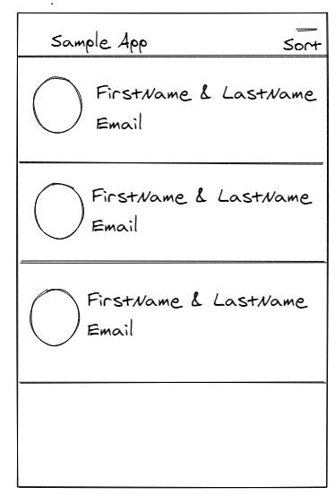

# Offline User List

A simple Offline User List

## Behavior

* Display list of users based on the design guideline you can find in list of attachments below
* Store users in Sqlite/Room DB
* Sort users based on id, least by default
* Implement pull to refresh functionality
* Remove users from the list as well as from local DB.

## Design Guidelines

* Single page app
* Create sort menu in appbar.
* Load image as circle format
* Bind all user details(Coming from API)

## API

* For API details use below URL https://reqres.in/api/users?page=1&per_page=20

## Wire Frame

* 